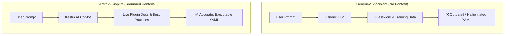
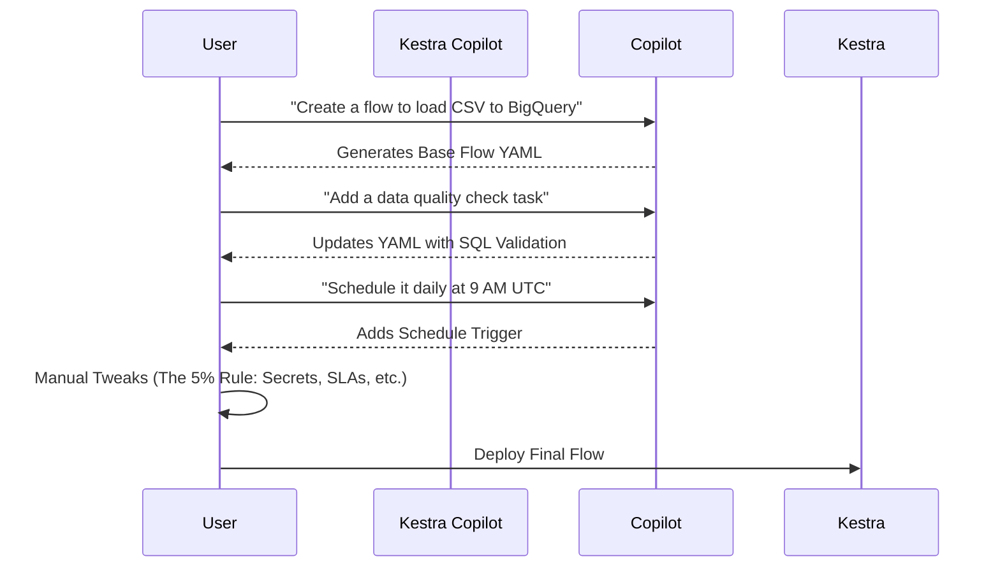
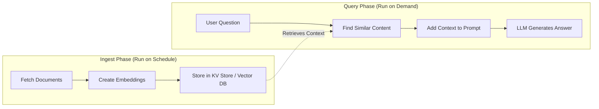
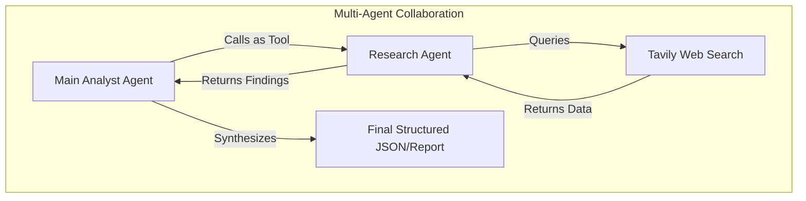
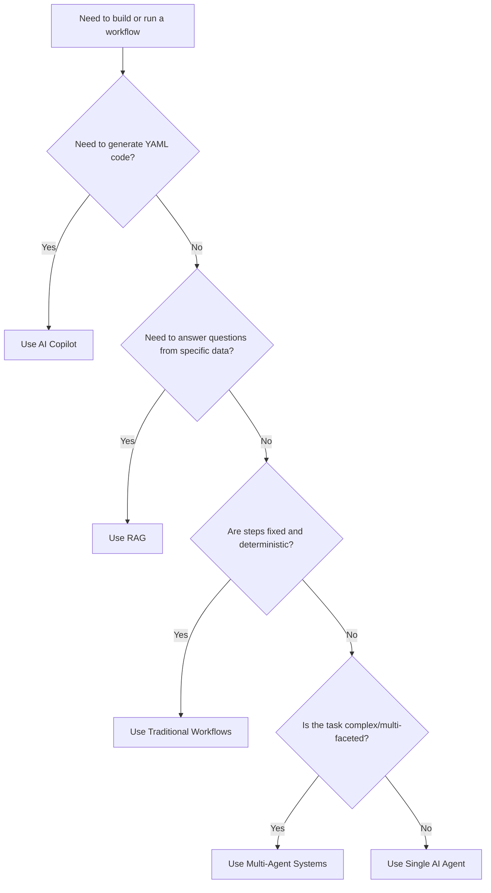

# 🤖 AI Orchestration with Kestra

Welcome to the **AI Orchestration** module! This guide explores how to integrate AI into data workflows using [Kestra](https://kestra.io/). You will learn how to accelerate workflow development, ground AI responses in real data, and build autonomous agents.

## 📑 Table of Contents
1. [Context Engineering](#-context-engineering)
2. [Environment Setup (Codespace Approach)](#-environment-setup-codespace-approach)
3. [AI Copilot](#-ai-copilot)
4. [Retrieval Augmented Generation (RAG)](#-retrieval-augmented-generation-rag)
5. [AI Agents](#-ai-agents)

---

## 🧠 Context Engineering

### The Problem with Generic AI
When building LLM applications, generic AI assistants (like ChatGPT in a browser) often lack the necessary context about your specific codebase, real-time data, or the latest software documentation. 

If you ask a generic LLM to generate a Kestra flow, it will likely produce:
*   **Outdated plugin syntax** (e.g., renamed task types).
*   **Incorrect property names** (e.g., properties that no longer exist).
*   **Hallucinated features** (e.g., tasks or triggers that were never created).

### The Solution: Grounded Context
Context is everything. By integrating AI directly into Kestra and providing it with current plugin documentation, valid property names, and organizational best practices, the AI can generate accurate, production-ready code.



---

## 🛠️ Environment Setup (Codespace Approach)

To get started quickly, especially in a GitHub Codespace environment, we have streamlined the setup process using environment variables and an automated bash script.

### Files Created for Setup
| File | Purpose |
|------|---------|
| `03-orchestration/.env` | Stores Docker Compose env vars (gitignored) |
| `03-orchestration/setup_kestra.sh` | One-shot setup script (gitignored) |

### Step-by-Step Codespace Instructions

**Option A — Use the setup script (recommended, does everything)**

```bash
cd 03-orchestration
bash setup_kestra.sh
```

That's it. The script will:
1. Export all env vars (raw key + 3 base64-encoded secrets).
2. Start Kestra with `docker compose up -d`.
3. Wait 30s for Kestra to boot.
4. Auto-import all 6 flows via the Kestra REST API.

---

**Option B — Manual step-by-step**

```bash
cd 03-orchestration

# 1. Export keys
export GEMINI_API_KEY="YOUR_GEMINI_KEY"
export SECRET_GEMINI_API_KEY=$(printf "%s" "YOUR_GEMINI_KEY" | base64 -w 0)
export SECRET_OPENAI_API_KEY=$(printf "%s" "YOUR_OPENAI_KEY" | base64 -w 0)
export SECRET_TAVILY_API_KEY=$(printf "%s" "YOUR_TAVILY_KEY" | base64 -w 0)

# 2. Start Kestra
docker compose up -d

# 3. Wait ~30s then import flows
curl -X POST -u 'admin@kestra.io:Admin1234!' http://localhost:8080/api/v1/flows/import -F fileUpload=@flows/1_chat_without_rag.yaml
curl -X POST -u 'admin@kestra.io:Admin1234!' http://localhost:8080/api/v1/flows/import -F fileUpload=@flows/2_chat_with_rag.yaml
curl -X POST -u 'admin@kestra.io:Admin1234!' http://localhost:8080/api/v1/flows/import -F fileUpload=@flows/3_rag_with_websearch.yaml
curl -X POST -u 'admin@kestra.io:Admin1234!' http://localhost:8080/api/v1/flows/import -F fileUpload=@flows/4_simple_agent.yaml
curl -X POST -u 'admin@kestra.io:Admin1234!' http://localhost:8080/api/v1/flows/import -F fileUpload=@flows/5_web_research_agent.yaml
curl -X POST -u 'admin@kestra.io:Admin1234!' http://localhost:8080/api/v1/flows/import -F fileUpload=@flows/6_multi_agent_research.yaml
```

### After Setup

| Item | Value |
|------|-------|
| **UI URL** | `http://localhost:8080` |
| **Login** | `admin@kestra.io` / `Admin1234!` |
| **Namespace** | `zoomcamp` |
| **First flow to run** | `4_simple_agent` |

> [!IMPORTANT]
> **In Codespace**, port 8080 will be auto-forwarded. Make sure it's set to **Public** in the Ports tab if the browser preview doesn't open automatically.

> [!WARNING]
> **Never push `setup_kestra.sh` or `.env`** — both are gitignored. If you restart Codespace, you must run `bash setup_kestra.sh` again (or manually re-export the vars) before `docker compose up -d` because env vars don't persist across sessions.

---

## ✨ AI Copilot

Building workflows manually requires knowing exact plugin syntax, property names, and task connections. **Kestra's AI Copilot** changes this by allowing you to describe your goal in natural language. The Copilot generates the flow structure for you, handling the boilerplate while you focus on specific logic.

### The 5% Rule
The AI Copilot gets you 95% of the way there. However, it doesn't know everything about your specific environment. You must apply the **5% Rule**: manually tweak the final 5% of the generated YAML to add your specific environment variables, secrets, error handling preferences, or custom task configurations.

### Iterative Refinement
The conversation with the Copilot is cumulative. You can iteratively build and refine flows.



---

## 📚 Retrieval Augmented Generation (RAG)

**RAG** solves the hallucination problem by ensuring the AI has access to current, accurate, and proprietary information at query time. It retrieves relevant information from your data sources, augments the AI prompt with that context, and generates a grounded response.

### How RAG Works in Kestra
RAG operates in two distinct phases: **Ingest** and **Query**.



*   **Ingest Phase:** Fetches documentation, converts text into vectors using an embedding model, and stores them (e.g., in Kestra's KV Store for demos, or a dedicated Vector DB for production).
*   **Query Phase:** Finds embeddings similar to the user's question, injects them into the LLM prompt, and generates a factual answer.

### Static RAG vs. Web Search RAG

Kestra supports two types of RAG retrievers:

| Feature | Static RAG | Web Search RAG |
| :--- | :--- | :--- |
| **Data Source** | Documents you ingested (e.g., internal docs) | Live web results (via Tavily) |
| **Best For** | Internal policies, fixed knowledge bases | Time-sensitive, frequently changing info |
| **Ingestion Step** | Required | Not required |
| **Example Question** | *"What does our refund policy say?"* | *"What is the latest release of Kestra?"* |

**Example Flows:**
*   `1_chat_without_rag.yaml`: Demonstrates hallucinations when asking about Kestra 1.1 features.
*   `2_chat_with_rag.yaml`: Ingests the Kestra 1.1 blog post and accurately answers the same question.
*   `3_rag_with_websearch.yaml`: Uses Tavily Web Search to fetch live context at query time without an ingestion step.

---

## 🤖 AI Agents

While RAG grounds AI in data, **AI Agents** take autonomy to the next level. Agents can make decisions, dynamically choose tools, and execute multi-step tasks without human intervention.

*   **Simple Agent (`4_simple_agent`)**: An AI that can execute basic tasks and make simple decisions.
*   **Web Research Agent (`5_web_research_agent`)**: An agent equipped with web search tools to gather live information and synthesize reports.
*   **Multi-Agent Research (`6_multi_agent_research`)**: A system where specialized agents collaborate (e.g., a Researcher agent and a Writer agent) to solve complex, multi-faceted tasks.

By combining **Context Engineering**, **AI Copilot**, **RAG**, and **Agents**, Kestra provides a robust platform for building production-ready, AI-driven data workflows.

## 🤖 AI Agents (Deep Dive)

While RAG grounds AI in your data, **AI Agents** introduce autonomy. Instead of following a fixed sequence of tasks, an agent dynamically decides what steps to take, which tools to use, and when it has gathered enough information to provide a final answer.

### The Agentic Loop
In Module 1, you built an agentic loop manually using a `while` loop: call the LLM, execute tool calls, send results back, and repeat until the LLM outputs a final answer. 
In Kestra, the `AIAgent` plugin automates this entire loop for you. You define the goal, the available tools, and the system message—Kestra manages the conversation history and drives the loop.

```mermaid
sequenceDiagram
    participant User
    participant Kestra AIAgent
    participant LLM (e.g., Gemini)
    participant Tools (e.g., Web Search)
    
    User->>Kestra AIAgent: Provide Goal & Tools
    Kestra AIAgent->>LLM: Send Prompt + System Message
    LLM-->>Kestra AIAgent: Request Tool Execution
    Kestra AIAgent->>Tools: Execute Tool
    Tools-->>Kestra AIAgent: Return Tool Output
    Kestra AIAgent->>LLM: Send Context + Tool Output
    LLM-->>Kestra AIAgent: Final Answer (No more tools needed)
    Kestra AIAgent-->>User: Output Final Result
```

### Traditional Workflows vs. AI Agents
| Feature | Traditional Workflow | AI Agent Workflow |
| :--- | :--- | :--- |
| **Logic** | Fixed sequence, predetermined logic | Agent decides the sequence based on the goal |
| **Best For** | Deterministic, repeatable ETL pipelines | Dynamic decisions, unexpected conditions |
| **Compliance** | Exact auditable processes | Harder to audit exact step-by-step path |
| **Cost/Latency** | Minimized and predictable | Variable (depends on LLM reasoning loops) |

### Anatomy of an AI Agent
An agent in Kestra requires a few key components:
*   **`systemMessage`**: Defines the agent's role, behavior, and constraints.
*   **`prompt`**: The actual task, question, or goal.
*   **`provider`**: The LLM configuration (e.g., Google Gemini, OpenAI).
*   **`tools`**: The capabilities the agent can invoke (e.g., Web Search, Code Execution).
*   **`memory`**: Optional context persistence across executions (e.g., Kestra KV Store).

### Agent Examples
1.  **Simple Agent (`4_simple_agent.yaml`)**: Demonstrates basic agent structure, summarizing text with controllable length and language. It uses `pluginDefaults` to avoid repetition and tracks token usage for cost monitoring.
2.  **Web Research Agent (`5_web_research_agent.yaml`)**: An autonomous agent that receives a research prompt, decides to use web search, evaluates results, loops if more info is needed, synthesizes a markdown report, and saves it to the filesystem.

### Available Agent Tools
Kestra provides a rich ecosystem of tools that agents can use:
| Tool | Purpose | Example Use |
| :--- | :--- | :--- |
| `TavilyWebSearch` | Search the web for current info | Market research, news monitoring |
| `GoogleCustomWebSearch` | Search via Google Custom Search API | General web search |
| `CodeExecution` | Run code safely via Judge0 | Math calculations, data validation |
| `KestraTask` | Execute any Kestra task | Leverage 1000+ Kestra plugins |
| `KestraFlow` | Trigger other Kestra flows | Modularity, calling sub-workflows |
| `MCP Clients` | Connect to MCP servers (HTTP, Docker, Stdio) | Integration with external systems |
| `AIAgent` | Use another agent as a tool | Multi-agent systems |

### Agent Observability
Kestra provides full observability for agent executions, including token usage, tool executions, and execution time. Enable detailed logging to see the LLM's reasoning:
```yaml
configuration:
  logRequests: true
  logResponses: true
```

---

## 🤝 Multi-Agent Systems

For highly complex tasks, a single agent might struggle with context limits or lose focus. **Multi-Agent Systems** solve this by breaking the problem down into specialized agents that collaborate.

### The "Agent as a Tool" Pattern
The core pattern in Kestra's multi-agent systems is using an `AIAgent` as a tool for another `AIAgent`. The main agent treats the sub-agent exactly like a web search or database call—it invokes it when needed and processes the returned data.

**Benefits:**
*   **Separation of Concerns**: Each agent focuses on one specific task.
*   **Easier Debugging**: You can isolate issues to a specific agent's logs.

### Example: Company Research (`6_multi_agent_research.yaml`)
This flow uses a two-agent system for competitor research:



1.  **Research Agent**: Specialized in web research. Uses `TavilyWebSearch` to find factual, current information.
2.  **Main Analyst Agent**: Specialized in analysis and synthesis. Uses the Research Agent as a tool to gather data, then structures the findings into a final output.

### Multi-Agent Best Practices
*   **Define clear responsibilities**: Ensure each agent has a specific role and doesn't overlap unnecessarily.
*   **Monitor token usage**: Multiple agents mean multiple LLM calls; costs can add up quickly.
*   **Document agent purposes**: Use flow and task descriptions to explain what each agent does for maintainability.

---

## 🏆 Best Practices

### Decision Matrix: When to Use What
Not every problem requires an AI agent. Use this matrix to choose the right approach:



| Scenario | Use This | Why |
| :--- | :--- | :--- |
| Creating/editing flows | **AI Copilot** | Fastest way to generate YAML flow code |
| Answering questions about your data | **RAG** | Grounds responses in real, proprietary data |
| Fixed, repeatable ETL pipelines | **Traditional workflows** | Deterministic, predictable, compliant |
| Research and analysis tasks | **AI Agents** | Can adapt to findings and make decisions |
| Complex, multi-step objectives | **Multi-agent systems** | Specialized agents working together |

### Cost Management
AI features use LLM APIs, which incur costs based on token usage. 
*   **Model Selection**: Use cheaper models (e.g., Gemini 2.5 Flash) for simple tasks and standard inference. Step up to stronger models (e.g., Gemini 3.5 Flash) only when complex reasoning is required.
*   **Cost-Saving Tips**:
    *   Start with the free tier for learning and development.
    *   Set `maxOutputTokens` to limit response size and prevent runaway costs.
    *   Monitor token usage in execution outputs.
    *   Use traditional workflows when determinism is sufficient.

### Security & Secrets
*   **Never commit API keys to Git!**
*   Always use Kestra's secret management: `apiKey: "{{ secret('GEMINI_API_KEY') }}"`
*   Export base64-encoded keys as `SECRET_`-prefixed environment variables before starting Kestra.
*   Rotate keys regularly (e.g., every 90 days) and monitor usage.

### Observability & Debugging
*   Enable `logRequests: true` and `logResponses: true` in the agent configuration to see the LLM's reasoning.
*   **Debugging Tips**:
    1.  Start with simple prompts and iterate.
    2.  Check logs for LLM reasoning and tool execution outputs.
    3.  Verify that tools are returning the expected data format.

### Production Readiness Checklist
Before deploying AI workflows to production:
- [ ] **Test thoroughly**: Run multiple times with different inputs to verify consistency.
- [ ] **Add fallbacks**: Handle API failures with retries and configure alerts on failure.
- [ ] **Set limits**: Cap `maxOutputTokens` to control costs and latency.
- [ ] **Document behavior**: Explain what the agent does in your flow and task descriptions.

---

## 🚀 Next Steps & Resources

### Module Summary
In this module, you have learned:
1.  Why **Context Engineering** matters and how generic AI assistants fail without it.
2.  How to use **AI Copilot** to generate and refine flows rapidly.
3.  How to implement **RAG** to ground AI responses in real data.
4.  How to build autonomous **AI Agents** that use tools and make decisions dynamically.
5.  How to design **Multi-Agent Systems** where specialized agents collaborate.
6.  **Best practices** for cost, security, observability, and production readiness.

### Where to Go From Here
*   **Experiment with Providers**: The flows use Gemini, but Kestra supports OpenAI, Anthropic, and more. Swap the `provider` block and compare results.
*   **Build Custom Agents**: Look at your existing workflows. Which parts involve decisions based on external data? Convert those steps into AI agents.
*   **Explore Blueprints**: Check out the [Kestra Blueprints library](https://kestra.io/blueprints) for pre-built AI and agent workflow patterns.
*   **Join the Community**: Connect with other developers in the [Kestra Slack community](https://kestra.io/slack).

### Useful Links
**Kestra Documentation:**
*   [AI Tools Overview](https://kestra.io/docs/ai-tools)
*   [AI Copilot](https://kestra.io/docs/ai-tools/ai-copilot)
*   [AI Agents](https://kestra.io/docs/ai-tools/ai-agents)
*   [RAG Workflows](https://kestra.io/docs/ai-tools/ai-rag-workflows)
*   [AI Plugin Reference](https://kestra.io/plugins/plugin-ai)

**External Resources:**
*   [Google Gemini API](https://ai.google.dev/docs) & [Google AI Studio](https://aistudio.google.com/)
*   [Tavily Web Search Docs](https://docs.tavily.com/)
*   [Kestra GitHub](https://github.com/kestra-io/kestra)

