# 📘 The Complete Guide to AI Workflow Orchestration with Kestra

Welcome to the definitive textbook on **AI Workflow Orchestration**. This guide is structured as a comprehensive book, taking you from the foundational concepts of context engineering and Docker to advanced multi-agent systems and production best practices. 

---

# 📖 Table of Contents

### **Part 1: Foundations & Architecture**
*   **Chapter 1:** Introduction to AI Workflow Orchestration
*   **Chapter 2:** Understanding Kestra Architecture
*   **Chapter 3:** Context Engineering

### **Part 2: Environment & Setup**
*   **Chapter 4:** Docker & Docker Compose Deep Dive
*   **Chapter 5:** Secrets & Environment Variables
*   **Chapter 6:** Complete Codespaces Setup Guide

### **Part 3: AI Copilot & Flow Generation**
*   **Chapter 7:** AI Copilot, Prompt Engineering & Flow Generation

### **Part 4: Retrieval Augmented Generation (RAG)**
*   **Chapter 8:** RAG Theory, Embeddings & Vector Search
*   **Chapter 9:** Web Search RAG & Flow Walkthroughs

### **Part 5: AI Agents**
*   **Chapter 10:** AI Agents, The Agentic Loop & Tool Calling
*   **Chapter 11:** Memory, Observability & Agent Walkthroughs

### **Part 6: Multi-Agent Systems**
*   **Chapter 12:** Multi-Agent Collaboration & Competitive Research

### **Part 7: Production Best Practices**
*   **Chapter 13:** Security, Cost Optimization & Monitoring
*   **Chapter 14:** Troubleshooting & Debugging

### **Part 8: Summary & Interview Prep**
*   **Chapter 15:** Cheat Sheet & 50 Interview Questions

---

# 🏛️ Part 1: Foundations & Architecture

## Chapter 1: Introduction to AI Workflow Orchestration

### What is Workflow Orchestration?
Workflow orchestration is the automated configuration, coordination, and management of complex computer systems and applications. In the context of AI, it means managing the lifecycle of AI models, data pipelines, and agentic loops.

### Traditional vs AI Workflow
Traditional workflows are deterministic. AI workflows are probabilistic and dynamic.

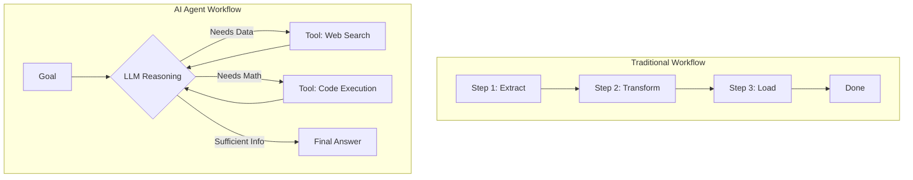

### Why AI Needs Orchestration
AI models are just engines; they need fuel (data), tools (APIs), and a steering wheel (orchestration). Kestra provides the steering wheel, allowing AI to interact with the real world reliably.

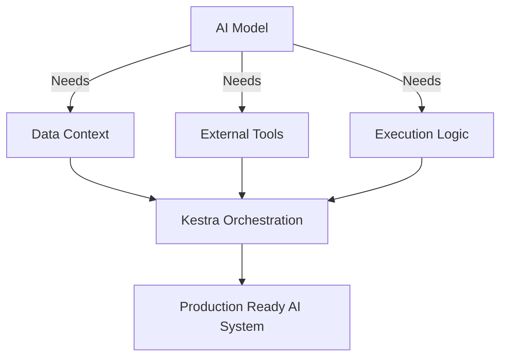

## Chapter 2: Understanding Kestra Architecture

Kestra is an open-source orchestration platform. Understanding its components is crucial for debugging and scaling.

### Complete Kestra Architecture

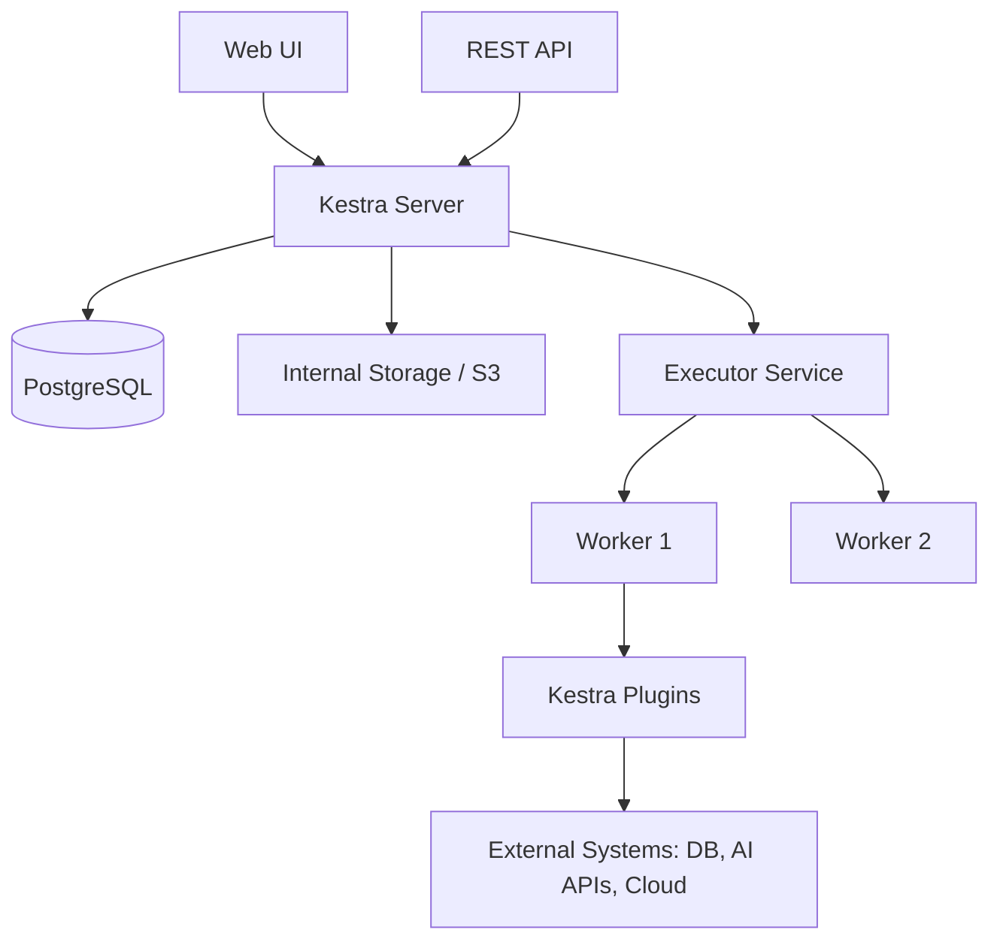

### Request Flow & Execution Lifecycle

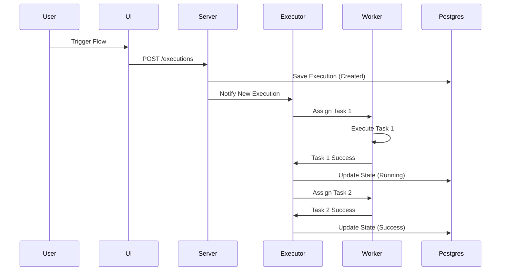

## Chapter 3: Context Engineering

### The Context Problem
Generic AI assistants lack context about your specific codebase, real-time data, or the latest software documentation.

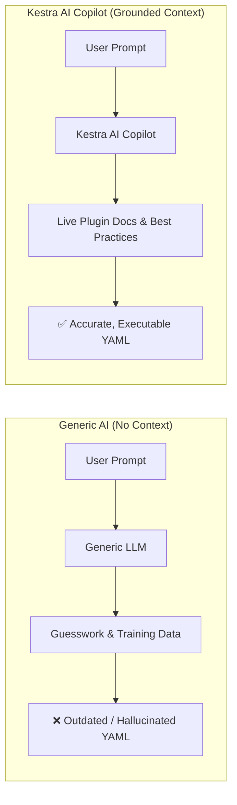

### Context Window & Knowledge Cutoff
LLMs have a "knowledge cutoff" date. They don't know about software updates released after their training. Context engineering solves this by injecting real-time data into the prompt.

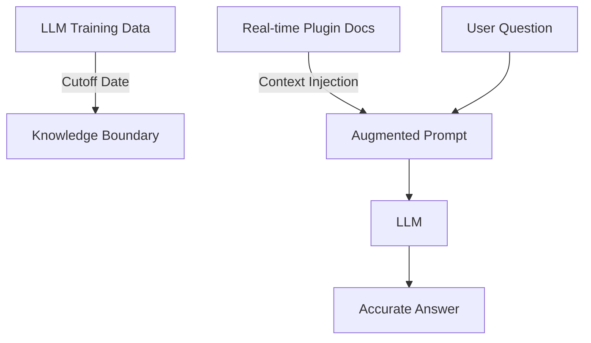

---

# 🛠️ Part 2: Environment & Setup

## Chapter 4: Docker & Docker Compose Deep Dive

### Docker Architecture
Docker uses a client-server architecture. The client talks to the daemon, which builds and runs containers.

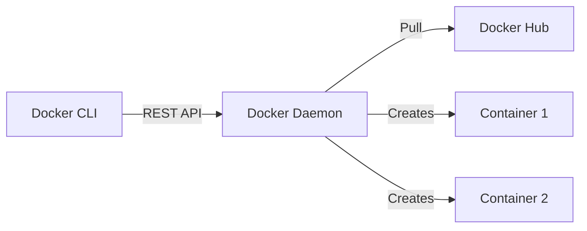

### Volumes, Networks, and Port Mapping
Containers are isolated. We use volumes for persistence, networks for communication, and port mapping for external access.

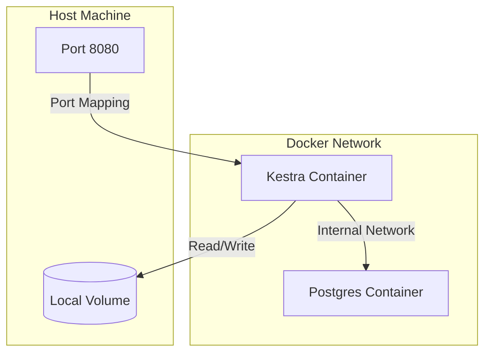

## Chapter 5: Secrets & Environment Variables

### The Secret Resolution Process
Never hardcode API keys. Kestra uses environment variables prefixed with `SECRET_` containing Base64-encoded values.

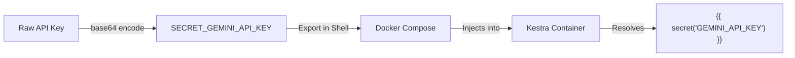

### Why Base64 Encoding?
Base64 encoding ensures that special characters in API keys (like `+`, `/`, `=`) don't break environment variable parsing or YAML configurations.

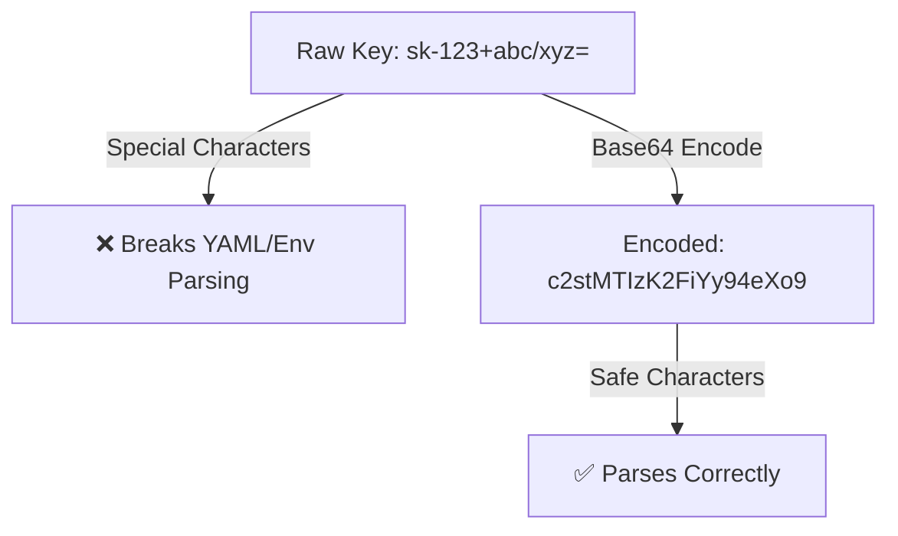

## Chapter 6: Complete Codespaces Setup Guide

### Project Structure

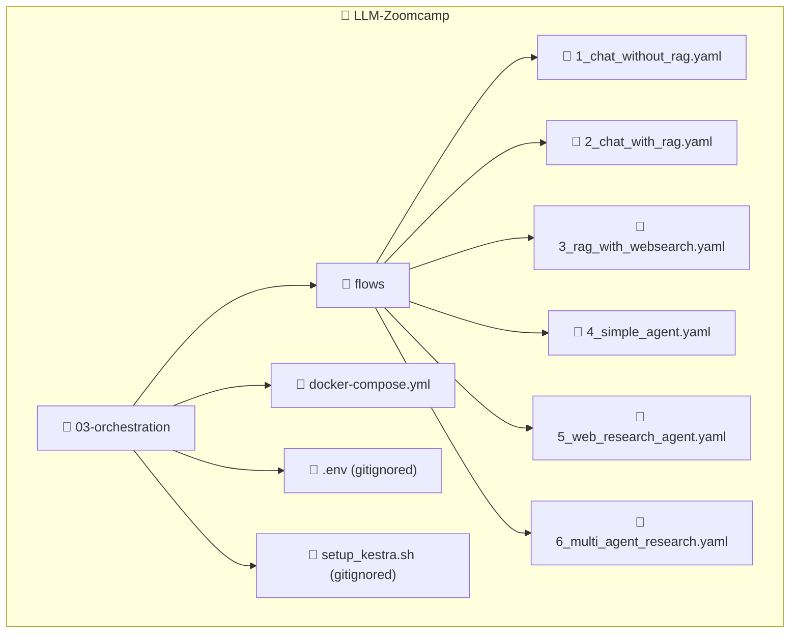

### Complete Setup Flow

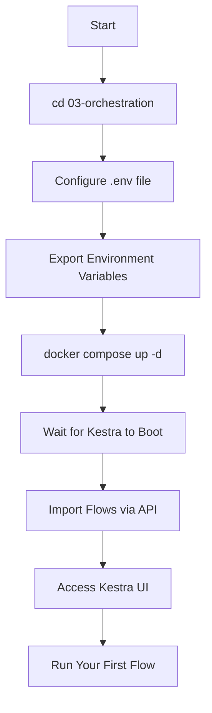

### The `.env` File & Setup Script
Create `03-orchestration/.env` (gitignored):
```bash
GEMINI_API_KEY="YOUR_GEMINI_API_KEY_HERE"
OPENAI_API_KEY="YOUR_OPENAI_API_KEY_HERE"
TAVILY_API_KEY="YOUR_TAVILY_API_KEY_HERE"

SECRET_GEMINI_API_KEY="YmFzZTY0X2VuY29kZWRfZ2VtaW5pX2tleQ=="
SECRET_OPENAI_API_KEY="YmFzZTY0X2VuY29kZWRfb3BlbmFpX2tleQ=="
SECRET_TAVILY_API_KEY="YmFzZTY0X2VuY29kZWRfdGF2aWx5X2tleQ=="
```

Create `03-orchestration/setup_kestra.sh` (gitignored):
```bash
#!/bin/bash
set -e
echo "🚀 Setting up Kestra..."

# Load .env if exists
if [ -f .env ]; then export $(grep -v '^#' .env | xargs); fi

# Set raw API keys (customize these)
export GEMINI_API_KEY="YOUR_GEMINI_API_KEY"
export OPENAI_API_KEY="YOUR_OPENAI_API_KEY"
export TAVILY_API_KEY="YOUR_TAVILY_API_KEY"

# Create base64 encoded secrets
export SECRET_GEMINI_API_KEY=$(printf "%s" "$GEMINI_API_KEY" | base64 -w 0)
export SECRET_OPENAI_API_KEY=$(printf "%s" "$OPENAI_API_KEY" | base64 -w 0)
export SECRET_TAVILY_API_KEY=$(printf "%s" "$TAVILY_API_KEY" | base64 -w 0)

echo "🐳 Starting Kestra..."
docker compose up -d
echo "⏳ Waiting 30s for boot..."
sleep 30

echo "📥 Importing flows..."
for flow in flows/*.yaml; do
  curl -X POST -u 'admin@kestra.io:Admin1234!' \
  "http://localhost:8080/api/v1/flows/import" \
  -F fileUpload=@"$flow" -s -o /dev/null
done
echo "✅ Setup Complete! Access UI at http://localhost:8080"
```

### Setup Script Execution Flow

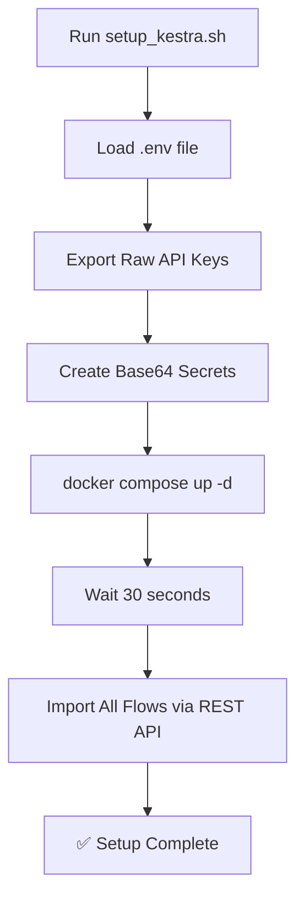

> [!WARNING]
> **In Codespaces**, port 8080 will be auto-forwarded. Make sure it's set to **Public** in the Ports tab. Environment variables do not persist across Codespace restarts; you must run `bash setup_kestra.sh` again.

---

# ✨ Part 3: AI Copilot & Flow Generation

## Chapter 7: AI Copilot

### How Copilot Works
Instead of guessing syntax, Kestra's AI Copilot reads the live plugin documentation of your running Kestra instance.

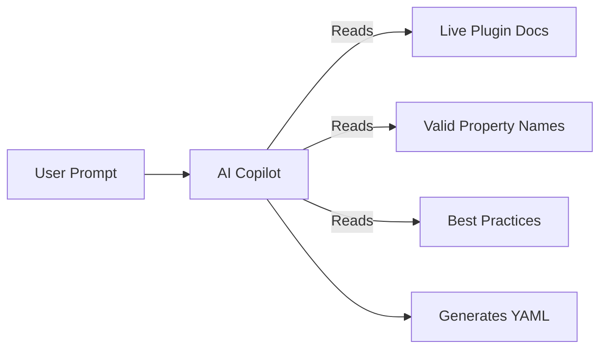

### The 5% Rule
Copilot gets you 95% of the way there. You must apply the **5% Rule**: manually tweak the final 5% to add your specific secrets, error handling, and custom configurations.

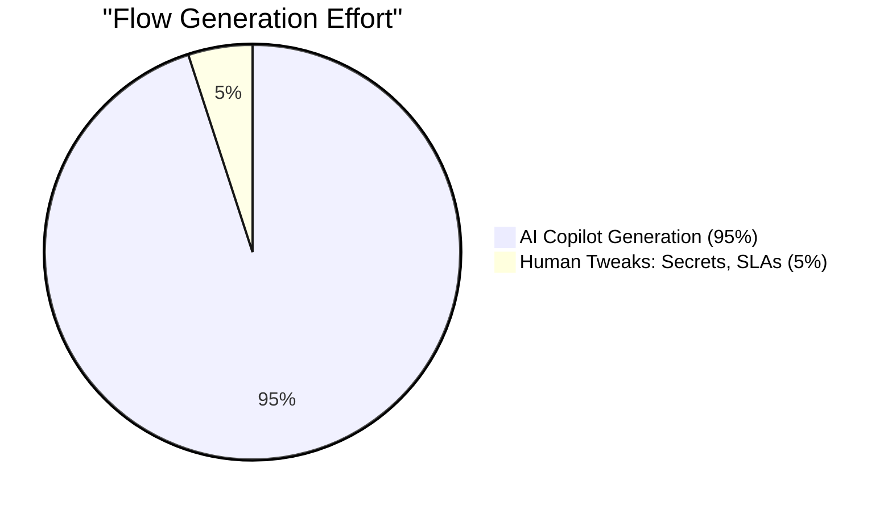

### Iterative Refinement
The conversation is cumulative. You can build flows step-by-step.

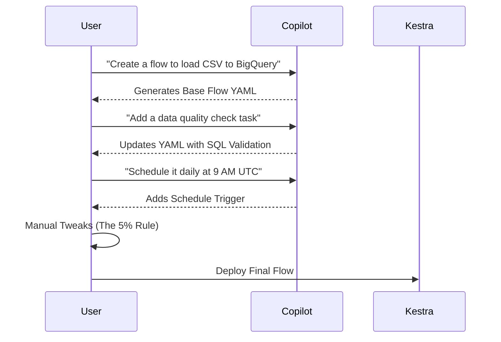

---

# 📚 Part 4: Retrieval Augmented Generation (RAG)

## Chapter 8: RAG Theory & Architecture

### RAG Architecture Overview
RAG operates in two phases: **Ingest** (offline) and **Query** (online).

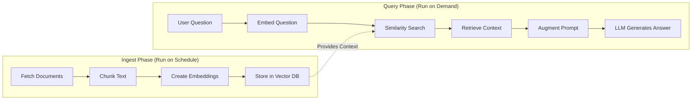

### Embedding & Vector Search Pipeline
Text is converted into high-dimensional vectors. Similarity is calculated using cosine similarity.

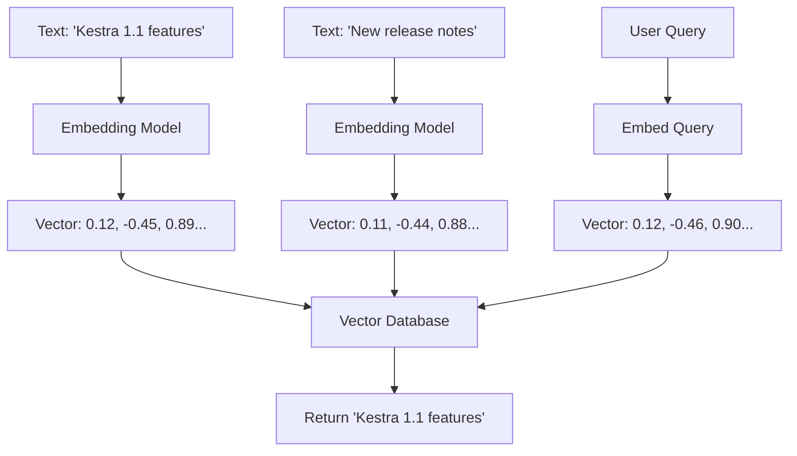

### Chunking Strategy
Large documents must be broken into meaningful chunks before embedding.

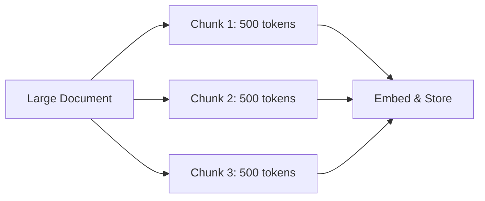

## Chapter 9: Web Search RAG & Flow Walkthroughs

### Static RAG vs Web Search RAG

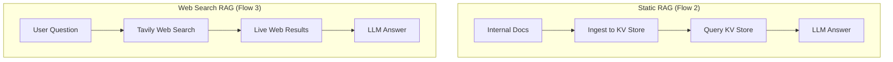

| Feature | Static RAG | Web Search RAG |
| :--- | :--- | :--- |
| **Data Source** | Documents you ingested | Live web results (Tavily) |
| **Best For** | Internal policies, fixed knowledge | Time-sensitive, changing info |
| **Ingestion Step** | Required | Not required |

---

# 🤖 Part 5: AI Agents

## Chapter 10: AI Agents & The Agentic Loop

### The Agentic Loop
Unlike traditional workflows, agents use a `while` loop to reason, call tools, and reflect.

```mermaid
sequenceDiagram
    participant User
    participant Agent
    participant LLM
    participant Tools
    
    User->>Agent: Provide Goal
    Agent->>LLM: Prompt + System Message
    LLM-->>Agent: Request Tool Execution
    Agent->>Tools: Execute Tool (e.g., Web Search)
    Tools-->>Agent: Return Tool Output
    Agent->>LLM: Send Context + Tool Output
    LLM-->>Agent: Final Answer (No more tools)
    Agent-->>User: Output Result
```

### Anatomy of an AI Agent

```mermaid
graph TD
    A[AIAgent Task] --> B[System Message: Role & Constraints]
    A --> C[Prompt: The Goal]
    A --> D[Provider: Gemini/OpenAI]
    A --> E[Tools: WebSearch, CodeExec]
    A --> F[Memory: KV Store]
```

## Chapter 11: Memory, Observability & Walkthroughs

### Tool Calling Sequence

```mermaid
sequenceDiagram
    participant Agent
    participant LLM
    participant Tavily
    
    Agent->>LLM: "Research AI trends"
    LLM-->>Agent: tool_call: TavilyWebSearch("AI trends 2026")
    Agent->>Tavily: Execute Search
    Tavily-->>Agent: Return JSON results
    Agent->>LLM: Context: {results}
    LLM-->>Agent: Final Markdown Report
```

### Agent Observability
Enable detailed logging to see the LLM's reasoning and tool calls.

```mermaid
graph LR
    A[Agent Execution] --> B[logRequests: true]
    A --> C[logResponses: true]
    B --> D[Kestra Logs]
    C --> D
    D --> E[Debug LLM Reasoning]
```

---

# 🤝 Part 6: Multi-Agent Systems

## Chapter 12: Multi-Agent Collaboration

### Agent as a Tool Pattern
The core pattern is using an `AIAgent` as a tool for another `AIAgent`.

```mermaid
graph TD
    Main[Main Analyst Agent] -->|Calls as Tool| Research[Research Agent]
    Research -->|Queries| Tavily[Tavily Web Search]
    Tavily -->|Returns Data| Research
    Research -->|Returns Findings| Main
    Main -->|Synthesizes| Report[Final Structured JSON]
```

### Delegation & Communication Patterns
Specialized agents prevent context window overflow and improve focus.

```mermaid
graph LR
    subgraph "Multi-Agent System"
        Manager[Manager Agent] -->|Delegates| Researcher[Research Agent]
        Manager -->|Delegates| Coder[Code Agent]
        Researcher -->|Returns Data| Manager
        Coder -->|Returns Code| Manager
        Manager -->|Final Output| User[User]
    end
```

---

# 🏆 Part 7: Production Best Practices

## Chapter 13: Security, Cost & Monitoring

### Decision Matrix

```mermaid
flowchart TD
    Start[Need to build workflow] --> Gen{Generate YAML?}
    Gen -->|Yes| Copilot[AI Copilot]
    Gen -->|No| Data{Answer from data?}
    Data -->|Yes| Rag[RAG]
    Data -->|No| Steps{Fixed steps?}
    Steps -->|Yes| Trad[Traditional Workflow]
    Steps -->|No| Complex{Complex/Multi-step?}
    Complex -->|Yes| Multi[Multi-Agent]
    Complex -->|No| Agent[Single Agent]
```

### Cost Optimization Strategy

```mermaid
graph TD
    A[AI Workflow] --> B{Task Complexity?}
    B -->|Simple| C[Use Gemini 2.5 Flash / Free Tier]
    B -->|Complex Reasoning| D[Use Gemini 3.5 Flash]
    A --> E[Set maxOutputTokens]
    A --> F[Monitor Token Usage]
```

### Security & Secret Management Lifecycle

```mermaid
graph LR
    A[Generate API Key] --> B[Base64 Encode]
    B --> C[Export as SECRET_ Env Var]
    C --> D[Docker Compose Injects]
    D --> E[Kestra Resolves via secret]
    E --> F[Rotate Every 90 Days]
```

## Chapter 14: Troubleshooting & Debugging

### Troubleshooting Flowchart

```mermaid
flowchart TD
    A[Issue] --> B{What's the Problem?}
    B -->|Container not starting| C[Check Docker logs]
    B -->|Port not accessible| D[Check port forwarding]
    B -->|Flows not importing| E[Check Kestra API]
    B -->|API key errors| F[Verify base64 encoding]
    C --> G[docker compose logs]
    D --> H[Check Codespace Ports tab]
    E --> I[curl localhost:8080]
    F --> J[echo $SECRET_GEMINI_API_KEY]
```

### Common Issues & Root Causes

| Symptom | Root Cause | Fix |
| :--- | :--- | :--- |
| **PostgreSQL unhealthy** | DB didn't initialize in time | Wait longer, or add `healthcheck` retries in `docker-compose.yml`. |
| **Secret not found** | Missing `SECRET_` prefix or Base64 error | Ensure env var is `SECRET_GEMINI_API_KEY` and correctly Base64 encoded. |
| **401 Unauthorized** | Invalid API key | Verify key on provider dashboard. |
| **Port 8080 not loading** | Codespace port is Private | Go to Ports tab in Codespace, change visibility to **Public**. |
| **Flow import fails** | Kestra not fully booted | Increase `sleep 30` to `sleep 60` in setup script. |

---

# 🎓 Part 8: Summary & Interview Prep

## Chapter 15: Cheat Sheet & 50 Interview Questions

### Kestra Setup Quick Reference

```mermaid
mindmap
  root((Kestra Setup))
    Files
      .env
      setup_kestra.sh
      flows/*.yaml
    Commands
      bash setup_kestra.sh
      docker compose up -d
    Access
      http://localhost:8080
      admin@kestra.io / Admin1234!
```

### Module Summary Mindmap

```mermaid
mindmap
  root((AI Orchestration))
    Context Engineering
      Grounding AI in real data
      Avoiding hallucinations
    AI Copilot
      Generating YAML
      The 5% Rule
    RAG
      Ingest & Query
      Static vs Web Search
    Agents
      Agentic Loop
      Tool Calling
    Multi-Agent
      Agent as a Tool
      Delegation
```

### 📝 50 Interview Questions & Answers

#### **Docker & Setup (1-10)**

**Q1: What is Docker?** A: A platform for developing, shipping, and running applications in isolated containers.

**Q2: Difference between Image and Container?** A: An image is an immutable template; a container is a running instance of an image.

**Q3: What is Docker Compose?** A: A tool for defining and running multi-container Docker applications using YAML.

**Q4: Why use volumes in Docker?** A: To persist data generated by containers beyond the container's lifecycle.

**Q5: What is port mapping?** A: Forwarding a port from the host machine to a port inside the container.

**Q6: Why do we need Base64 encoding for secrets?** A: To prevent special characters in API keys from breaking environment variable parsing.

**Q7: How does Kestra resolve secrets?** A: It looks for environment variables prefixed with `SECRET_` and decodes them from Base64.

**Q8: What happens if you restart a Codespace?** A: Environment variables are lost; you must re-run the setup script.

**Q9: How do you check Docker container logs?** A: `docker compose logs` or `docker logs <container_id>`.

**Q10: What is a Docker network?** A: A virtual network that allows containers to communicate with each other securely.

#### **Kestra Architecture (11-20)**

**Q11: What are the main components of Kestra?** A: Server, Executor, Worker, PostgreSQL, and Internal Storage.

**Q12: What is the role of the Executor?** A: It manages the execution lifecycle, dispatching tasks to Workers.

**Q13: What does the Worker do?** A: It executes the actual tasks (plugins) assigned by the Executor.

**Q14: Why does Kestra need PostgreSQL?** A: To store flow definitions, execution states, and metadata.

**Q15: What is a Kestra Namespace?** A: A logical grouping for flows, similar to a folder or schema.

**Q16: How do you trigger a flow via API?** A: `POST /api/v1/executions/{namespace}/{flowId}`.

**Q17: What is a Kestra Plugin?** A: A modular component that provides specific tasks (e.g., SQL, AI, HTTP).

**Q18: How does Kestra handle errors?** A: Using `errors` blocks or `errors` tasks to define fallback logic.

**Q19: What is the Kestra KV Store?** A: A simple key-value store built into Kestra for caching and state management.

**Q20: Can Kestra run Python scripts?** A: Yes, using the `io.kestra.plugin.scripts.python.Commands` task.

#### **Context Engineering & Copilot (21-25)**

**Q21: What is Context Engineering?** A: The practice of providing LLMs with the exact, real-time information they need to perform a task accurately.

**Q22: Why do generic AI assistants hallucinate?** A: They rely on outdated training data and lack access to real-time documentation.

**Q23: How does Kestra AI Copilot avoid hallucinations?** A: It is grounded in the live plugin documentation of the running Kestra instance.

**Q24: What is the "5% Rule" in AI Copilot?** A: Copilot generates 95% of the flow; humans must tweak the final 5% (secrets, specific configs).

**Q25: Is the Copilot conversation cumulative?** A: Yes, follow-up prompts modify the existing flow structure.

#### **RAG (26-35)**

**Q26: What is RAG?** A: Retrieval Augmented Generation; retrieving data and injecting it into the LLM prompt.

**Q27: What are the two phases of RAG?** A: Ingest (offline) and Query (online).

**Q28: What is an embedding?** A: A numerical (vector) representation of text that captures its semantic meaning.

**Q29: What is cosine similarity?** A: A metric used to determine how similar two vectors are.

**Q30: Why chunk documents in RAG?** A: To fit within the LLM's context window and improve retrieval precision.

**Q31: Difference between Static RAG and Web Search RAG?** A: Static uses pre-ingested docs; Web Search fetches live data at query time.

**Q32: What is Tavily?** A: A search engine optimized for AI agents and RAG.

**Q33: Where does Kestra store embeddings in the demos?** A: In the Kestra KV Store (for production, use a dedicated Vector DB).

**Q34: How do you prevent RAG hallucinations?** A: By ensuring high-quality chunking, accurate embeddings, and strict prompt instructions.

**Q35: What is a vector database?** A: A database optimized for storing and querying high-dimensional vectors (e.g., Pinecone, Milvus).

#### **AI Agents & Multi-Agent (36-50)**

**Q36: What is an AI Agent?** A: An autonomous system that uses an LLM to reason, decide on actions, and use tools to achieve a goal.

**Q37: What is the Agentic Loop?** A: The cycle of LLM reasoning -> tool execution -> context update -> repeat until done.

**Q38: What is "Tool Calling"?** A: The LLM's ability to output a structured request to execute an external function.

**Q39: Name three tools available in Kestra.** A: TavilyWebSearch, CodeExecution, KestraTask.

**Q40: What is Agent Memory?** A: Persisting conversation history or state across multiple executions (e.g., via KV Store).

**Q41: How do you enable agent observability?** A: Set `logRequests: true` and `logResponses: true` in the configuration.

**Q42: What is a Multi-Agent System?** A: A system where multiple specialized agents collaborate to solve complex tasks.

**Q43: What is the "Agent as a Tool" pattern?** A: Using one `AIAgent` task as a tool that another `AIAgent` can invoke.

**Q44: Why use Multi-Agent instead of a single Agent?** A: Separation of concerns, easier debugging, and preventing context window overflow.

**Q45: How does the Research Agent communicate with the Analyst Agent?** A: The Analyst calls the Research Agent as a tool; the Research Agent returns JSON/text data.

**Q46: When should you use a Traditional Workflow over an Agent?** A: When steps are deterministic, repeatable, and require strict compliance/auditing.

**Q47: How do you optimize AI Agent costs?** A: Use cheaper models (Flash), set `maxOutputTokens`, and monitor token usage.

**Q48: What is a common security risk with AI Agents?** A: Exposing API keys in logs or Git; always use Kestra secrets.

**Q49: How do you debug a failing Agent?** A: Check the LLM reasoning logs, verify tool outputs, and simplify the prompt.

**Q50: What is the future of AI Orchestration?** A: Moving from single agents to autonomous, multi-agent swarms managing entire data platforms.

---

> **End of Textbook.** You now have a comprehensive understanding of AI Workflow Orchestration with Kestra. 
